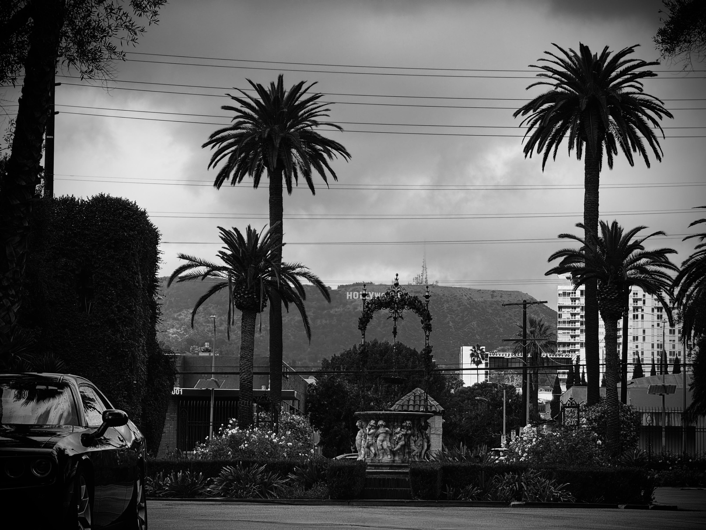

# 💜 𝙰𝚛𝚌𝚊𝚗𝚊 𝙵𝚊𝚖𝚒𝚐𝚕𝚒𝚊

<figure><figcaption></figcaption></figure>

### <mark style="color:purple;">The</mark> <mark style="color:orange;">Tarot Major Arcana</mark> <mark style="color:purple;">is</mark>&#x20;

### <mark style="color:purple;">a set of 22 cards with a narrative</mark>

### <mark style="color:purple;">describing</mark> <mark style="color:orange;">the hero's journey towards</mark>&#x20;

### <mark style="color:orange;">enlightenment and self-realization</mark>

### <mark style="color:purple;">(and a playing tool for neophytes)</mark>
