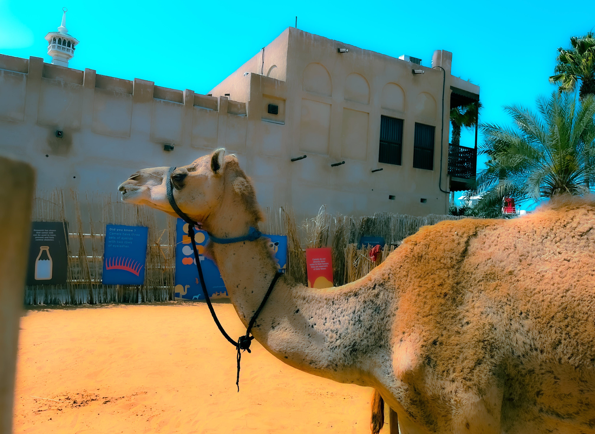

# 💙 𝙰𝚛𝚌𝚊𝚗𝚒 𝙼𝚒𝚗𝚘𝚛𝚒

<figure><figcaption></figcaption></figure>

### <mark style="color:purple;">The Tarot Minor Arcana set represents four narratives (hero's journeys) through the</mark> [<mark style="color:purple;">four forces of nature</mark>](../../../alchemy/the-usdchoice-of-alchemy/undefined-4/the-four-elements/)<mark style="color:purple;">.</mark>

### <mark style="color:purple;">➡️ The 4 suits represent:</mark> [<mark style="color:purple;">fire</mark>](../../../alchemy/the-usdchoice-of-alchemy/undefined-4/the-four-elements/fuoco.md) <mark style="color:purple;">(wands),</mark> [<mark style="color:purple;">air</mark>](../../../alchemy/the-usdchoice-of-alchemy/undefined-4/the-four-elements/aria.md) <mark style="color:purple;">(sword),</mark> [<mark style="color:purple;">earth</mark>](../../../alchemy/the-usdchoice-of-alchemy/undefined-4/the-four-elements/terra.md) <mark style="color:purple;">(coins), and</mark> [<mark style="color:purple;">water</mark>](../../../alchemy/the-usdchoice-of-alchemy/undefined-4/the-four-elements/acqua.md) <mark style="color:purple;">(cups).</mark>

### <mark style="color:purple;">➡️ Each</mark> [<mark style="color:purple;">number</mark>](../../../astrology/the-usdchoice-of-astrology/angles/angles.md) <mark style="color:purple;">represents a symmetrical chapter in the journey.</mark>

### <mark style="color:purple;">➡️ Court cards represent human</mark> [<mark style="color:purple;">archetypes</mark>](../../../astrology/the-usdchoice-of-astrology/constellations/)<mark style="color:purple;">: king (yang power), queen (yin power), knight (unstable yang, action, responsibility to others, sexual desires, adolescents), page (unstable yin, study, exploration, offer, children).</mark>
