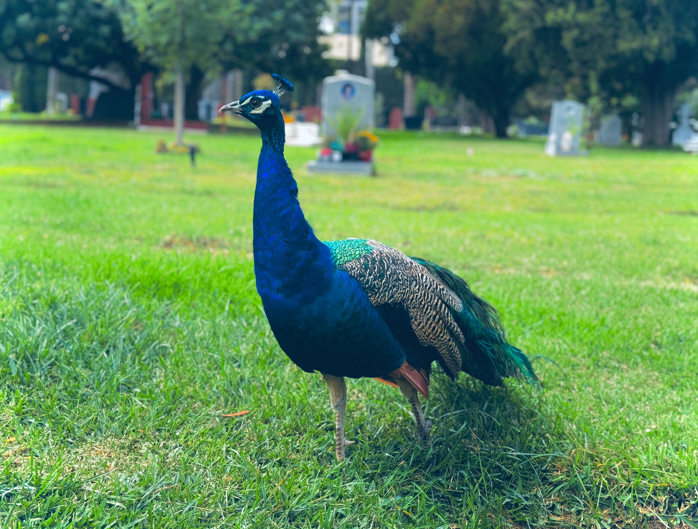

# Cups

<figure><figcaption></figcaption></figure>

### <mark style="color:purple;">The suit of Cups is tied to the elemental force of</mark> <mark style="color:orange;">water</mark><mark style="color:purple;">.</mark>&#x20;

### <mark style="color:purple;">It speaks of emotions, introspection, romance, love, friendship, relationships, reflection, quiet experiences, joy, fantasy, passivity.</mark>

### <mark style="color:green;">Learn about the alchemy interpretation of the</mark> <mark style="color:orange;">water</mark> <mark style="color:green;">element</mark> [here](../../../../../alchemy/the-usdchoice-of-alchemy/undefined-4/the-four-elements/acqua.md)<mark style="color:green;">.</mark>
