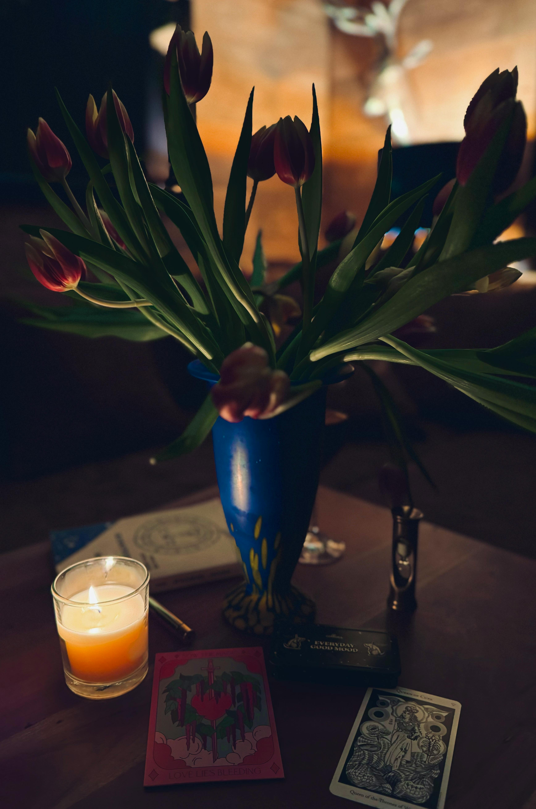

# Dude of Cups

<figure><figcaption></figcaption></figure>

### <mark style="color:purple;">someone romantic</mark>

### <mark style="color:purple;">incoming love</mark>&#x20;

### <mark style="color:purple;">creativity</mark>&#x20;

### <mark style="color:purple;">romance</mark>&#x20;

### <mark style="color:purple;">charm</mark>&#x20;

### <mark style="color:purple;">imagination</mark>&#x20;

### <mark style="color:purple;">moody</mark>&#x20;

### <mark style="color:purple;">artistic</mark>&#x20;

### <mark style="color:purple;">idealist</mark>

### <mark style="color:purple;">a young emotional person in the player's life (water traits, in the masculine side)</mark>
