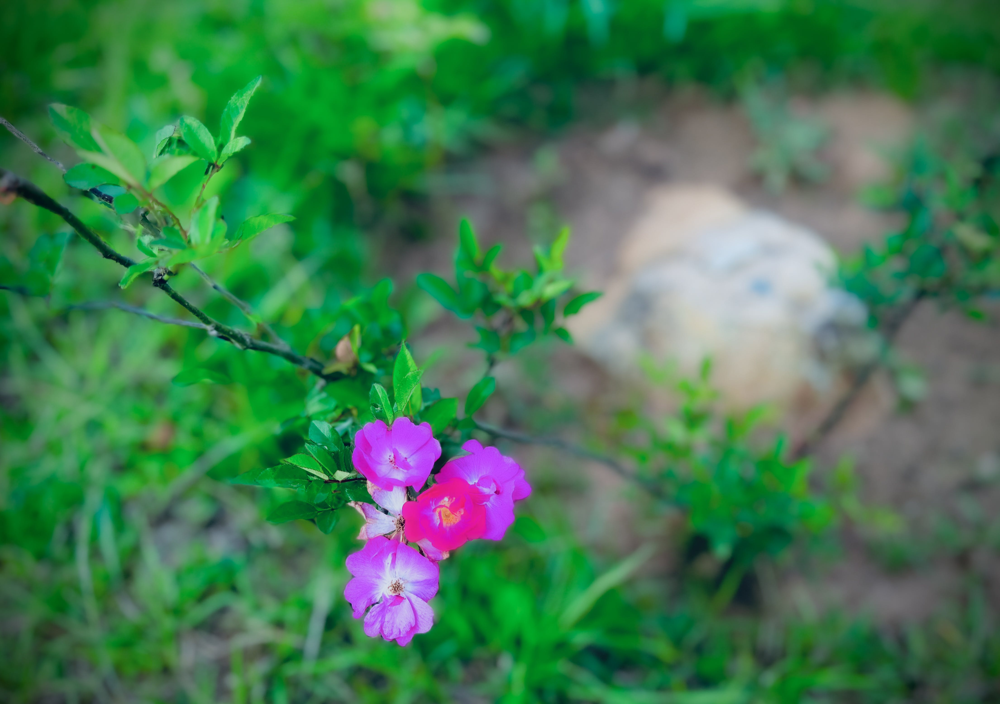

# Swords

<figure><figcaption></figcaption></figure>

### <mark style="color:purple;">The suit of Swords is tied to the elemental force of</mark> <mark style="color:orange;">air</mark><mark style="color:purple;">, and tends to represent</mark> <mark style="color:orange;">communication.</mark>

### <mark style="color:purple;">Swords is the predominant negative suit in Tarot, as their journey's meaning is related to the</mark> <mark style="color:orange;">consequences of the player's actions and decisions.</mark> <mark style="color:purple;">It represents conflict, angry or disturbed emotions, sadness, mental activity, wisdom, the use of intellect to understand the truth.</mark>

### <mark style="color:green;">Learn about the alchemy interpretation of the</mark> <mark style="color:orange;">air</mark> <mark style="color:green;">element</mark> [here<mark style="color:green;">.</mark>](../../../../../alchemy/the-usdchoice-of-alchemy/undefined-4/the-four-elements/aria.md)
