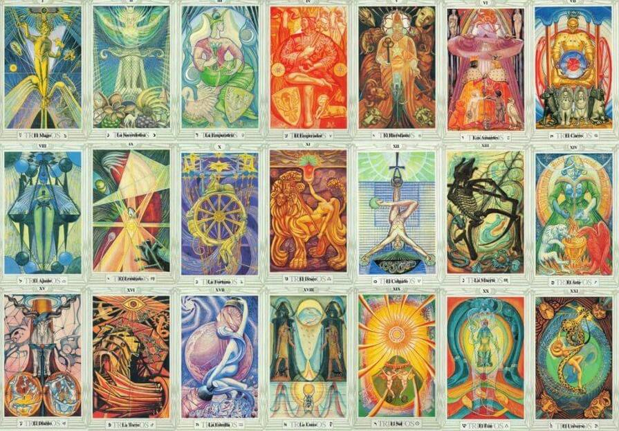

---
layout:
  title:
    visible: true
  description:
    visible: true
  tableOfContents:
    visible: true
  outline:
    visible: false
  pagination:
    visible: true
---

# The Thoth Tarot

### <mark style="color:purple;">The</mark> <mark style="color:orange;">Thoth Tarot deck</mark> <mark style="color:purple;">was designed by Aleister Crowley and painted by Lady Frieda Harris.</mark>&#x20;

### <mark style="color:purple;">It's correlated related to the Kabbalah (Hebrew), and</mark> <mark style="color:orange;">recommended for advanced magickians</mark><mark style="color:purple;">.</mark>

<figure><figcaption></figcaption></figure>

### <mark style="color:green;">The original intent was to correct the classic, medieval tarot, giving it a connection to</mark> [astrology](../../../astrology/the-usdchoice-of-astrology/).

<figure><figcaption>
Liber 777, by Aleister Crowley
</figcaption></figure>

